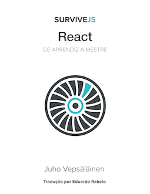

 

# SurviveJS - React

> **IMPORTANTE!** Se você quer apoiar o desenvolvimento desse livro, você pode [comprar uma cópia no Leanpub](https://leanpub.com/survivejs-react). Existe também uma [versão impressa disponível na Amazon](http://www.amazon.com/SurviveJS-Webpack-React-apprentice-master/dp/152391050X/) (é uma versão anterior que fala sobre Webpack e React).

Esse livro mostra como construir uma pequena aplicação Kanban utilizando React. Durante o processo, você irá aprender os conceitos básicos e será capaz de aprender novas habilidades com o decorrer dos seus projetos. Você também [pode ler a versão online](http://survivejs.com/react/introduction/).

## Como Usar esse Repositório?

Esse repositório está dividido em duas partes principais: `manuscript` (manuscrito) e `project_source` (código fonte). Você poderá encontrar os capítulos grauitos em `manuscript`, eles estão organizados por capítulo. Enquanto `project_source` está o código fonte associado a cada capítulo.

Não existe maneira correta para ler esse livro. Tudo depende da sua experiência e interesse. Você pode construir esse projeto do zero, seguindo o livro, ou você pode começar em um ponto específico. Basta utilizar o código fonte do capítulo anterior como seu ponto de início.

Vale a pena notar que, esse repositório tem como padrão o branch `dev` do livro. `master` contém o código fonte da versão mais recente. Cada versão é marcada, ficando mais fácil para voc6e achar o código fonte da versão do livro que você está lendo.

## Dúvidas e Suporte

Como nenhum livro é perfeito, talvez você encontre algum problem ou tenha alguma dúvida relacionada ao conteúdo. Existem várias formas para resolver isso:

* Entre em contato comigo através do [GitHub Issue Tracker](https://github.com/survivejs/react/issues)
* Participe do grupo no [Gitter Chat](https://gitter.im/survivejs/react)
* Siga [@survivejs](https://twitter.com/survivejs) no Twitter para ficar por dentro das novidades oficiais ou me envie um tweet diretamente em [@bebraw](https://twitter.com/bebraw)
* Me envie um email em [info@survivejs.com](mailto:info@survivejs.com)
* Me pergunte qualquer coisa sobre Webpack ou React em [SurviveJS AmA](https://github.com/survivejs/ama/issues)

Se você postar uma pergunta no [Stack Overflow](http://stackoverflow.com/search?q=survivejs), use a tag [**survivejs**](https://stackoverflow.com/questions/tagged/survivejs), assim, eu serei notificado. Você também pode usar a hashtag **#survivejs** no Twitter.

## Novidades

Eu divulgo novidades do SurviveJS através de alguns canais:

* [Newsletter](http://eepurl.com/bth1v5)
* [Twitter](https://twitter.com/survivejs)
* [Blog RSS](http://survivejs.com/atom.xml)

Fique à vontade para participar!

## Contribuindo

Feedback e PRs são muito bem-vindos! Veja *CONTRIBUTING.md* para mais informações.

## Licença

